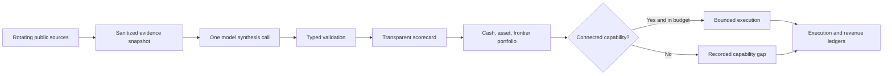

# M4 Continuous Founder Runtime

## Operating Thesis

More reasoning capacity expands the search space, but revenue still requires a buyer, distribution, trust, a payment path, and useful execution. M4 therefore gives the agent broad strategic autonomy while bounding each six-hour cycle by actual capabilities and measurable resource limits.

The agent may consider any lawful category. Missing accounts constrain execution only; they do not remove a strategy from consideration.

## Runtime

One cycle performs these steps:

1. Select up to six least-recently-attempted sources from the allowlist.
2. Preserve only last-known-good observations when a source fails.
3. Supply sanitized observations, current opportunity IDs, and channel state to one bounded GitHub Models call.
4. Reject proposals with invented evidence, incomplete scores, invalid channels, unsupported authority, negative economics, or prohibited conduct.
5. Merge validated proposals into a rolling 40-opportunity memory.
6. Rerank the typed opportunity set and reassess incumbents every day, while deferring score-only replacement until 50 measured impressions, 25 qualified contacts, or seven validation days.
7. Resolve execution against the full typed catalog and prioritize an active human checkout plus current portfolio before model-selected or top-ranked fallbacks.
8. Execute only through explicit capability grants and resource budgets.
9. Test, commit, and directly deploy the exact operated state to GitHub Pages.

GitHub Models uses the workflow's ephemeral `GITHUB_TOKEN` with `models: read`. No model credential is stored. The requested `openai/gpt-5.5` remains the first preference, followed by `openai/gpt-5`; the repository token currently cannot invoke either preferred model, so the runtime uses GitHub's documented `openai/gpt-4.1` workflow fallback. Temporary access failures are remembered for seven days, then retried automatically. When inference is unavailable, discovery and deterministic scoring continue without fabricating new ideas.

## Cycle Budget

| Resource | Maximum per cycle |
| --- | ---: |
| Public source fetches | 6 |
| Model calls | 1 |
| New validated opportunities | 4 |
| New channel candidates | 3 |
| Commercial publications | 1 |
| External messages | 3 |
| Commercial repository writes | 1 |
| Owner-funded spend | $0 |
| Runtime | 12 minutes |

Control-plane snapshots are always written for auditability. The repository-write limit applies to a new commercial asset, not to the evidence and execution ledgers needed to prove what happened.

## Capability Policy

Current connected grants:

- publish one public-safe commercial asset through GitHub Pages
- reply to up to three inbound issues carrying the project's `revenue-experiment` label

The inbound grant is repository-specific and inbound-only. The runtime cannot open unsolicited issues on other repositories, persist issue bodies, or exceed the message budget.

The public Stripe Payment Link for the full audit is connected. Capabilities still awaiting real configuration include compliant outbound messaging, marketplace writes, Stripe account management, agent-native payment receipt, verified-revenue reinvestment, and collectible minting. These are eligible future actions rather than permanent prohibitions.

Identity, KYC, tax, bank, legal acceptance, contracts, account creation, and physical purchases remain owner actions because an agent cannot truthfully manufacture those facts or permissions.

## Distribution Fallback

The model may identify a strong opportunity that does not survive the current portfolio or top-three eligibility check. That no longer ends the cycle with a blocked record. The runtime first considers the human-configured active checkout, then current cash, asset, and frontier experiments, then an eligible model selection and remaining ranked fallbacks.

Every candidate must still use a connected publishing channel, match the explicit GitHub Pages publication grant, fit the one-publication budget, and differ from an already published asset. The fallback publishes availability; it does not claim that traffic, checkout starts, or demand occurred.

## Current Dual-Rail Product

MCP / Agent Preflight turns one deterministic engine into a free acquisition surface and two paid transaction shapes:

- a free browser route that evaluates public GitHub metadata without executing target code
- a `$149` authorized full audit for a human buyer
- a planned `$0.25` basic or `$1` expanded public-evidence machine report through x402, with no target-code execution

The official MCP Inspector is an abundant free substitute for interactive protocol debugging. The paid differentiation is therefore a repeatable connection-readiness decision, prioritized report, and repair outcome. The x402 route remains a contract until three qualified recurring-use requests, a runtime host, and a dedicated receiving wallet exist.

## Roblox Integration

Roblox is evaluated as both a virtual economy and a distribution platform.

Primary evidence from [Roblox monetization](https://create.roblox.com/docs/monetize), the [Creator Store](https://create.roblox.com/docs/production/creator-store), [experience discovery](https://create.roblox.com/docs/production/promotion/discovery), and [Open Cloud place publishing](https://create.roblox.com/docs/cloud/guides/usage-place-publishing) currently supports three separate hypotheses:

| Hypothesis | Upside | Main penalty | Current score |
| --- | --- | --- | ---: |
| Launch Lens Studio plugin at $14.99 | Reusable USD asset, marketplace discovery, 100% of net proceeds | Seller identity, 30-day escrow, product-specific demand unproven | 6.74 |
| Retention Repair Sprint at $249 | Concrete outcome for a live team | Free official analytics and no connected buyer channel | 6.18 |
| Embodiment Factory game | Visits can compound into virtual goods, Creator Rewards, and ads | Low first-dollar probability, extreme competition, retention and live-ops burden | 5.26 |

Roblox reports that its top 1,000 creators averaged $1.3 million in 2025. The same official page reports a $1,550 median among more than 35,000 DevEx participants. M4 records both: the ceiling justifies continued scanning; the distribution prevents the agent from treating a random game launch as easy money.

The plugin remains the strongest current Roblox wedge but is not forced into the portfolio. A new Roblox signal can change that in any future cycle.

## Deployment Correction

[Commits pushed by a workflow's `GITHUB_TOKEN` do not trigger a second workflow run](https://docs.github.com/en/actions/concepts/security/github_token). M4 therefore uses the [custom GitHub Pages workflow](https://docs.github.com/en/pages/getting-started-with-github-pages/using-custom-workflows-with-github-pages) to upload and deploy the operated repository state directly. The dashboard can no longer remain stale while the scheduled operator commits newer JSON behind it.

## Revenue Truth

M4 does not infer revenue from calls, views, issue comments, model output, Roblox creator averages, or marketplace listings. Only a completed ledger transaction with a unique ID, verification reference, verification timestamp, and positive gross amount changes revenue.

- Current verified gross revenue: **$0.00**
- Current verified net revenue: **$0.00**
- Current physical-form fund: **$0.00**

The human Stripe checkout is active for the paid full audit. The missing runtime host plus receiving wallet still block x402; neither is represented as active.
